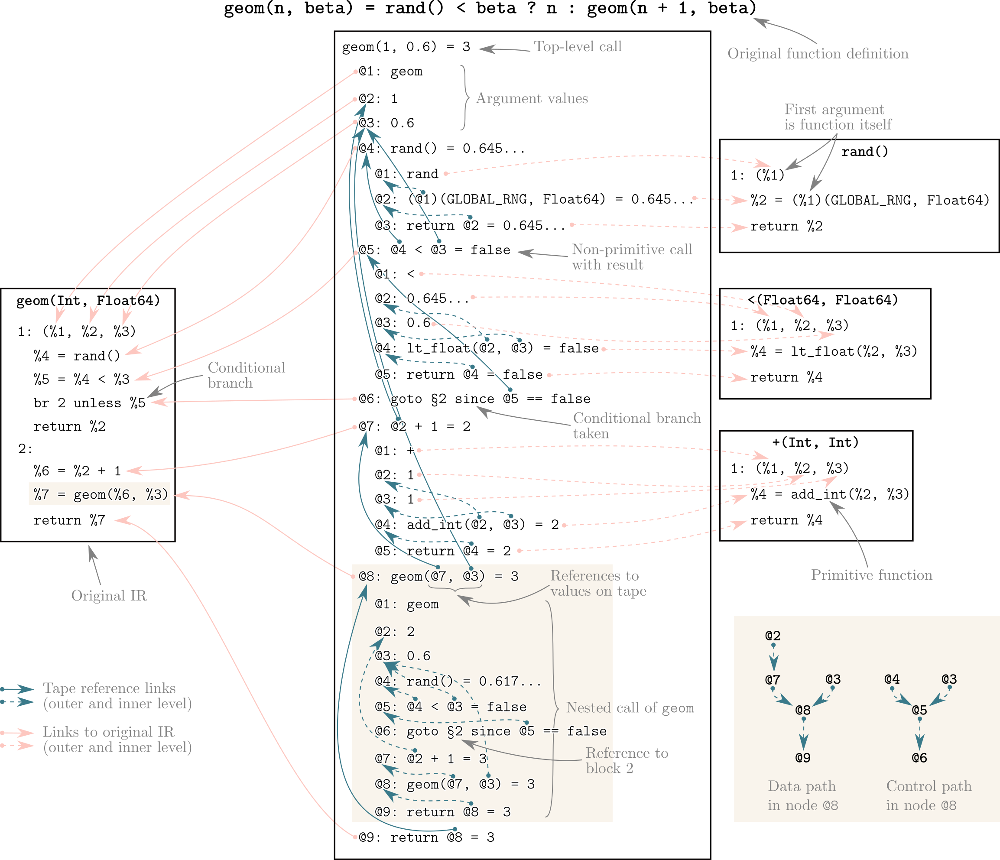

# DynamicComputationGraphs.jl

[](https://travis-ci.org/phipsgabler/DynamicComputationGraphs.jl)

The aim of this project is to provide a graph representation suitable for dynamic models, as they
occur in probabilistic programming languages (e.g. with stochastic control flow, or model
recursion).  To implement this, I use an approach between the two traditional ideas: operator
overloading and source transformations.  The resulting data structure is an “extended Wengert list”
– a generalization of traditional Wengert lists used for backward mode AD, which 1) also records
control flow operations, 2) preserves the hierarchy of function calls by being nested, instead of
fully linearized, and 3) can carry arbitrary metadata, which is customizable by a context system
(similar to what you can do in Cassette.jl).

The representation should be able to:

- Perform the usual forward computation (without performance overhead by interpretation)
- Record expression nodes representing the calculation (raw `Expr` or something equivalent, allowing
  to convert back)
- Record meta-information from the original code, such as information about random variable types,
  conditions, etc.
- Record, if applicable, information needed for backward calculation
- The backward information in the graph should be mutable, so that one can update subgraphs without
  full re-evaluation when changing parts of a model.


## Design

My basic idea is to use a nested tape, consisting of the IR instructions of the executed code,
including control flow.  This type should be similar to a Wengert list, in that it records linearly
the statements executed during the execution of a function, but contain information about function
calls (so, more like nested Wengert lists) and metadata.

These should be possible to extract by inserting a "recording statement" after each instruction
of a given function.

If we look at a simple function with stochastic control flow, 

    geom(n, β) = rand() < β ? n : geom(n + 1, β)
    
with IR code

```
1: (%1, %2, %3)
  %4 = Main.rand()
  %5 = %4 < %3
  br 2 unless %5
  return %2
2:
  %6 = %2 + 1
  %7 = Main.geom(%6, %3)
  return %7
```

(using [IRTools](https://github.com/MikeInnes/IRTools.jl) format ), we would record a trace of
`geom(1, 0.5)` as follows, under the assumption that `rand()` returns a value greater than β the
first time and less the second time:
    
```
julia> printlevels(track(geom, 1, 0.5), 3)
⟨geom⟩(⟨1⟩, ⟨0.5⟩) = 3
  @1: [Argument §1:%1] = geom
  @2: [Argument §1:%2] = 1
  @3: [Argument §1:%3] = 0.5
  @4: [§1:%4] ⟨rand⟩() = 0.5649805445318339
    @1: [Argument §1:%1] = rand
    @2: [§1:%2] @1(⟨some huge Mersenne twister constant⟩, ⟨Float64⟩) = 0.5649805445318339
    @3: [§1:&1] return @2 = 0.5649805445318339
  @5: [§1:%5] ⟨<⟩(@4, @3) = false
    @1: [Argument §1:%1] = <
    @2: [Argument §1:%2] = 0.5649805445318339
    @3: [Argument §1:%3] = 0.5
    @4: [§1:%4] ⟨lt_float⟩(@2, @3) = false
    @5: [§1:&1] return @4 = false
  @6: [§1:&1] goto §2 since @5 == false
  @7: [§2:%6] ⟨+⟩(@2, ⟨1⟩) = 2
    @1: [Argument §1:%1] = +
    @2: [Argument §1:%2] = 1
    @3: [Argument §1:%3] = 1
    @4: [§1:%4] ⟨add_int⟩(@2, @3) = 2
    @5: [§1:&1] return @4 = 2
  @8: [§2:%7] ⟨geom⟩(@7, @3) = 3
    @1: [Argument §1:%1] = geom
    @2: [Argument §1:%2] = 2
    @3: [Argument §1:%3] = 0.5
    @4: [§1:%4] ⟨rand⟩() = 0.9938271839338844
    @5: [§1:%5] ⟨<⟩(@4, @3) = false
    @6: [§1:&1] goto §2 since @5 == false
    @7: [§2:%6] ⟨+⟩(@2, ⟨1⟩) = 3
    @8: [§2:%7] ⟨geom⟩(@7, @3) = 3
    @9: [§2:&1] return @8 = 3
  @9: [§2:&1] return @8 = 3
```

or in a simplified graphical form: 



(This result is expanded to only three levels, since the full output would be huge.)

Here, the indented lines indicate the "inner code" recorded in the recursive calls.  Since we record
intermediate values as well, and track data dependencies by pointers, this is equivalent to a
traditional tape used for backward mode AD, just with the control flow nodes between.

This, together with the original IR, while being a bit cryptic, contains the following information:

- Every executed statement, linked to the original.  Corresponding SSA values in the original code
  are annotated in [brackets], by their block and variable id (`§s:%i`).  Arguments, having no
  associated expressions, are prefixed with `Arg:`.
- All intermediate values on the data path. They are, as all nodes, numbered as `@i`. These are
  referred to in expressions recorded, to that a backward pass is trivial.
- The branching instructions actually taken, written in literal form `goto label`.  Blocks are
  referred to by paragraph signs: `§b`.  They are annotated as well with the block they come from,
  and the position among all branch statements within that block: `[§b:&position]`.
- Nested function calls and their arguments (note that the argument `%1` stands for the function itself and
  is not used most of the time).
- Constants (literals in the expressions) are written in ⟨angle brackets⟩ (this makes debugging the
  transformed code easier).

In this form, a backward pass is as trivial as following back the references from the last `return` and adding 
adjoint values in the metadata.

The data structure used for this is an abstract `AbstractNode` type, with subtypes for:

- Arguments and constants;
- Special calls (such as `:inbounds`) and primitive calls (by default, everything which is builtin
  or intrinsic, but this can be changed by using a context – see below);
- Nested calls, containing recursively the nodes from a non-primitive call; and
- Return and jump nodes, being recorded when a branch is taken.
  

## Implementation

Constructing this kind of trace should be possible by extending the original IR by inserting a
constant number of statements before and after each original statement (and some at the beginning of
each block), somehow like this:

```
julia> @code_tracked geom(1, 0.5)
1: (%4, %1, %2, %3)
  %5 = saveir!(%4, 1: (%1, %2, %3)
                     %4 = rand()
                     %5 = %4 < %3
                     br 2 unless %5
                     return %2
                   2:
                     %6 = %2 + 1
                     %7 = geom(%6, %3)
                     return %7)
  %6 = TapeConstant(%1)
  %7 = trackedargument(%4, %6, $(QuoteNode(1)), $(QuoteNode(§1:%1)))
  %8 = record!(%4, %7)
  %9 = TapeConstant(%2)
  %10 = trackedargument(%4, %9, $(QuoteNode(2)), $(QuoteNode(§1:%2)))
  %11 = record!(%4, %10)
  %12 = TapeConstant(%3)
  %13 = trackedargument(%4, %12, $(QuoteNode(3)), $(QuoteNode(§1:%3)))
  %14 = record!(%4, %13)
  %15 = TapeConstant(rand)
  %16 = tuple()
  %17 = trackedcall(%4, %15, %16, $(QuoteNode(§1:%4)))
  %18 = record!(%4, %17)
  %19 = TapeConstant(:<)
  %20 = trackedvariable(%4, $(QuoteNode(%4)))
  %21 = trackedvariable(%4, $(QuoteNode(%3)))
  %22 = tuple(%20, %21)
  %23 = trackedcall(%4, %19, %22, $(QuoteNode(§1:%5)))
  %24 = record!(%4, %23)
  %25 = tuple()
  %26 = trackedvariable(%4, $(QuoteNode(%5)))
  %27 = trackedjump(%4, 2, %25, %26, $(QuoteNode(§1:&1)))
  %28 = trackedvariable(%4, $(QuoteNode(%2)))
  %29 = trackedreturn(%4, %28, $(QuoteNode(§1:&2)))
  br 2 (%27) unless %24
  br 3 (%2, %29)
2: (%30)
  %31 = record!(%4, %30)
  %32 = TapeConstant(:+)
  %33 = trackedvariable(%4, $(QuoteNode(%2)))
  %34 = tuple(%33, $(QuoteNode(⟨1⟩)))
  %35 = trackedcall(%4, %32, %34, $(QuoteNode(§2:%6)))
  %36 = record!(%4, %35)
  %37 = TapeConstant(geom)
  %38 = trackedvariable(%4, $(QuoteNode(%6)))
  %39 = trackedvariable(%4, $(QuoteNode(%3)))
  %40 = tuple(%38, %39)
  %41 = trackedcall(%4, %37, %40, $(QuoteNode(§2:%7)))
  %42 = record!(%4, %41)
  %43 = trackedvariable(%4, $(QuoteNode(%7)))
  %44 = trackedreturn(%4, %43, $(QuoteNode(§2:&1)))
  br 3 (%42, %44)
3: (%45, %46)
  %47 = record!(%4, %46)
  return %45
```

The extra argument, `%4`, is a `GraphRecorder` object where all statements are recorded onto using `record!`.  Each kind of statement is reified by a call to `tracked<whatever>`, and finally replaced by `record!`, which returns its original value. The function `trackcall` then recursively does the same kind of thing to the nested calls.

This can be achieved by using an `IRTools`
[dynamo](https://mikeinnes.github.io/IRTools.jl/latest/dynamo/), which in essence is just a fancier
generated function, allowing one to operate with `IRTools.IR` instead of "raw" `CodeInfo`s.  In this
dynamo, the original IR is completely rebuilt to insert all necessary tracking statements.

There’s some things to note:

- Branches are recorded by first creating a node for each branch in a block, then passing this as an
  extra argument to the actual branch.  The actual recording is done in the target block.  For this
  reason, all return branches are replaced by jumps to an extra “return block” at the end. 
- There’s some additional runtime logic in the `trackcall` function, which determines how to
  differentiate between “primitive” and “non-primitive” calls (serving as the stopping case for the
  recursive tracking).
- The purpose of `trackedvariable` is to make sure that tape references (`@i` in the output) actually point to
  the last usage of a SSA variable (since that can happen multiple times in a loop).
- There are some splice-in `QuoteNode`s.  These result from inlined literal values known at the time
  of the transformation (either because they are statically determined, such as IR
  indices/locations, or because they result from literals in the original code).
  

### Contexts

You may have noticed that all `tracked<whatever>` functions above take the `GraphRecorder` as their first 
argument.  Through this, a context object gets passed down the transformed functions, and is
used for dispatch in in the internal functions (mostly `trackcall`).  These context arguments work
similar to the contexts in Cassette.jl, and let you overload the behaviour of how tracking works by providing
custom implementations of a method of the tracker functions.

The main parts of customizable behaviour are 1) to change what is considered a primitive (e.g., a
“primitively” differentiable function is primitive in an AD application – no need to recurse
further), and 2) to record custom metadata.

This system is basically working, but still a bit under construction (mostly in that there will be
more points provided that can be overloaded, and documentation given).


## Trying it out

Currently, there are only a couple of very primitive examples in `runtests.jl`, but the interface is
simple:

    node = track(f, args...)
    
`node` will be a `NestedCallNode` (unless `f` is primitive), with `value(node)` being the result of
`f(args...)`.

Since tracked graphs are recursive, they can become very large.  To inspect only the “top level” of
them, you can use `printlevels`:

```
julia> f(x) = sin(x) + x
f (generic function with 1 method)

julia> node = track(f, 1.0);

julia> printlevels(node, 2)
⟨f⟩(⟨1.0⟩) = 1.8414709848078965
  @1: [Arg:§1:%1] f	
  @2: [Arg:§1:%2] 1.0	
  @3: [§1:%3] ⟨sin⟩(@2) = 0.8414709848078965
  @4: [§1:%4] ⟨+⟩(@3, @2) = 1.8414709848078965
  @5: [§1:&1] return @4 = 1.8414709848078965
```

Nodes in general may have `children` and a `parent`:

```
julia> children(node)
5-element Array{AbstractNode,1}:
 @1: f
 @2: 1.0
 @3: ⟨sin⟩(@2) = 0.8414709848078965
 @4: ⟨+⟩(@3, @2) = 1.8414709848078965	
 @5: return @4 = 1.8414709848078965
 
julia> parent(node[4]) === node
true
```

As you can see, normal indexing can also be used to access the children of a nested node.

There are provided several functions to inspect the dependencies in the code.  `referenced` results
in the parent nodes which a node directly references, and `backwards` follows back these references
transitively (within the current `NestedCallNode`):

```
julia> printlevels(node, 2)
⟨f⟩(⟨1.0⟩) = 1.8414709848078965
  @1: [Arg:§1:%1] f	
  @2: [Arg:§1:%2] 1.0	
  @3: [§1:%3] ⟨sin⟩(@2) = 0.8414709848078965
  @4: [§1:%4] ⟨+⟩(@3, @2) = 1.8414709848078965
  @5: [§1:&1] return @4 = 1.8414709848078965
  
julia> referenced(node[5])
1-element Array{NestedCallNode,1}:
 @4: ⟨+⟩(@3, @2) = 1.8414709848078965
 
julia> backward(node[5])
3-element Array{AbstractNode,1}:
 @4: ⟨+⟩(@3, @2) = 1.8414709848078965	
 @3: ⟨sin⟩(@2) = 0.8414709848078965
 @2: 1.0
```

`dependents` and `forward` are the corresponding query functions in the other direction:

```
julia> dependents(node[2])
2-element Array{NestedCallNode,1}:
 @3: ⟨sin⟩(@2) = 0.8414709848078965
 @4: ⟨+⟩(@3, @2) = 1.8414709848078965	

julia> forward(node[2])
3-element Array{AbstractNode,1}:
 @3: ⟨sin⟩(@2) = 0.8414709848078965
 @4: ⟨+⟩(@3, @2) = 1.8414709848078965	
 @5: return @4 = 1.8414709848078965
```

See also the `query` function for a more detailed, internal iterface to the node hierarchy.

Finally, we can also inspect the various contents of each node:

```
julia> typeof(node[3])
NestedCallNode

julia> value(node[3])
0.8414709848078965

julia> node[3].call.f
⟨sin⟩

julia> value(node[3].call.f)
sin (generic function with 12 methods)

julia> node[3].call.arguments
(@2,)

julia> value.(node[3].call.arguments)
(1.0,)
```

Each node also has a `location`, which can be used to as an index into the original IR:

```
julia> printlevels(node[4], 1)  # this node is huge...
@4: [§1:%4] ⟨+⟩(@3, @2) = 1.8414709848078965

julia> location(node[4])
§1:%4

julia> node[4].info.original_ir[location(node[4])]
IRTools.Inner.Statement(:(%1 + %3), Any, 1)
```

See `graphapi.jl`, `nodes.jl`, and `tapeexpr.jl` for more functionality.


### Contexts

If we want to use contexts, we have to create a new subtype of `AbstractTrackingContext`.  Say we
want to limit the recursive tracking to a maximum level (to avoid having to call `printlevels` every
time), then we could start with the following:

```
struct DepthLimitContext <: AbstractTrackingContext
    level::Int
    maxlevel::Int
end

DepthLimitContext(maxlevel) = DepthLimitContext(1, maxlevel)

# a little helper:
increase_level(ctx::DepthLimitContext) = DepthLimitContext(ctx.level + 1, ctx.maxlevel)
```

Then, we can overload some functions for things we want to change:

```
import DynamicComputationGraphs: canrecur, tracknested

# this is the main thing to make this work: 
canrecur(ctx::DepthLimitContext, f, args...) = ctx.level < ctx.maxlevel

# and if we recur into a nested function, we need to update the level in the context:
function trackednested(ctx::DepthLimitContext, f_repr::TapeExpr,
                       args_repr::ArgumentTuple{TapeValue}, info::NodeInfo)
    new_ctx = increase_level(ctx)
    return recordnestedcall(new_ctx, f_repr, args_repr, info)
end
```

`recordnestedcall` is the fallback implementation, like `recurse` in Cassette.jl, and
returns a `NestedCallNode` with the recorded children.

Once we have a custom context, we can just pass it as the first argument to `track`:

```
julia> call = track(DepthLimitContext(2), geom, 1, 0.5)
⟨geom⟩(⟨1⟩, ⟨0.5⟩) = 3
  @1: [Arg:§1:%1] geom	
  @2: [Arg:§1:%2] 1	
  @3: [Arg:§1:%3] 0.5	
  @4: [§1:%4] ⟨rand⟩() = 0.6323441648826984	
  @5: [§1:%5] ⟨<⟩(@4, @3) = false	
  @6: [§1:&1] goto §2 since @5 == false 
  @7: [§2:%6] ⟨+⟩(@2, ⟨1⟩) = 2	
  @8: [§2:%7] ⟨geom⟩(@7, @3) = 3	
  @9: [§2:&1] return @8 = 3
```

Note that here, all the nodes at level 2 are `PrimitiveNode`s!

If no context is provided, the constant `DEFAULT_CTX::DefaultTrackingContext` will be used, which
tracks everything down to primitive/intrinsic functions (see `isbuiltin`), and records no additional
metadata.  `DepthLimitContext` is also provided by the library, in case you need it.

At the moment, the overloadable methods are `canrecur`, `trackedargument`, `trackedcall`, `trackedconstant`, 
`trackedjump`, `trackednested`, `trackedprimitive`, `trackedreturn`, and `trackedspecial`.  Provided 
fallbacks are `recordnestedcall`, as explained, and `isbuiltin` for `canrecur` (you are not
forced to use these, but otherwise, you’d have to manually construct the node structures to return.)


